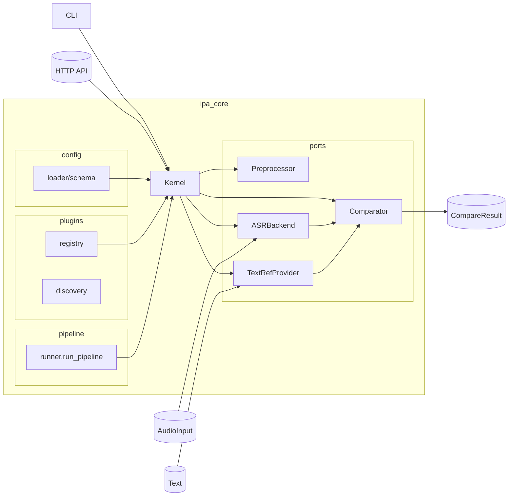

# PronunciaPA

Reconocimiento fonético a IPA con CLI, API HTTP y soporte para Allosaurus.

## Instalación rápida

```bash
# Entorno de desarrollo (FastAPI + pruebas)
pip install -e .[dev]

# Dependencias de audio/ASR (Allosaurus, micrófono, conversión MP3)
pip install -e .[speech]
```

> Si solo quieres usar el stub para pruebas, basta con `pip install -e .[dev]` y exportar `PRONUNCIAPA_ASR=stub`.
> El extra `[speech]` requiere ffmpeg (para MP3) y PortAudio (para `sounddevice`).

## Uso por consola

```bash
# Transcribir un WAV/MP3
pronunciapa transcribe --audio inputs/ejemplo.wav --lang es

# Grabar desde micrófono (3 segundos por defecto)
pronunciapa transcribe --mic --seconds 4 --lang es --json
```

El comando usa `TranscriptionService` con Allosaurus (o con el stub si `PRONUNCIAPA_ASR=stub`).  
La salida JSON incluye `ipa`, `tokens` y metadatos básicos del audio.

> Conversión MP3→WAV se realiza vía `pydub`, por lo que necesitas `ffmpeg` en tu PATH.

## API HTTP `/pronunciapa/transcribe`

Levanta el servidor con:

```bash
uvicorn ipa_core.api.http:get_app --reload --port 8000
```

Envío de archivos:

```bash
curl -X POST http://localhost:8000/pronunciapa/transcribe \
  -F "lang=es" \
  -F "audio=@inputs/ejemplo.wav"
```

Streaming en vivo (enviar bytes crudos):

```bash
curl -X POST http://localhost:8000/pronunciapa/transcribe \
  -H "Content-Type: application/octet-stream" \
  --data-binary @inputs/ejemplo.wav
```

La respuesta es JSON con tokens IPA, texto unido, idioma y metadatos del backend.

## Pruebas

Todos los tests usan el backend stub:

```bash
PRONUNCIAPA_ASR=stub PYTHONPATH=. pytest \
  ipa_core/services/tests/test_transcription_service.py \
  ipa_core/api/tests/test_http_transcription.py \
  scripts/tests/test_cli_transcribe_stub.py

# Tests existentes del preprocesador
PYTHONPATH=. pytest scripts/tests/test_preprocessor_basic.py
```

## Estructura principal

- `ipa_core/` (núcleo, servicios y plugins)
- `config/` (YAML del kernel)
- `scripts/` (herramientas de prueba manual)
- `frontend/` (UI en Vite/Tailwind)
- `docs/` (backlog, milestones y acuerdos de diseño)

Arquitectura (mermaid)
----------------------


