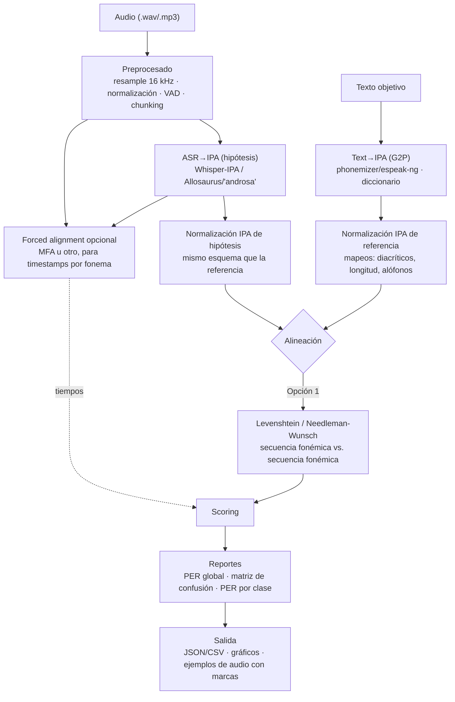

# IPA Core
No tiene logica

## Objetivo
- Nucleo que orquesta:
  1) Backend ASR (audio a IPA),
  2) Conversor de texto a IPA (TextRef),
  3) Comparador (IPA vs IPA).
- Extensible con plugins sin tocar el nucleo.

## Estructura
ipa_core/
  api/        # CLI y futura API
  backends/   # ASR (vozIPA)
  compare/    # Comparacion de cadenas IPA
  textref/    # TextoIPA (G2P)
  kernel.py   # Orquestacion de plugins
  plugins.py  # Carga de entry points

### api/
- cli.py: comandos `ipa plugins` y `ipa run` basados en Typer.

### backends/
- base.py: interfaz ASRBackend.transcribe_ipa(audio_path) -> str
- null_backend.py: stub de prueba.
- whisper_ipa.py: stub para Whisper-IPA.

### compare/
- base.py: interfaz Comparator.compare(...) -> CompareResult
- noop.py: stub (PER=0, sin ops).

### textref/
- base.py: interfaz TextRef.text_to_ipa(text, lang) -> str
- noop.py: stub de prueba.

### Nucleo
- kernel.py: instancia plugins segun KernelConfig.
- plugins.py: carga por entry points.

## Pipeline

## Configuración del kernel

Consulte [`docs/kernel.md`](docs/kernel.md) para la guía detallada sobre la
configuración (`KernelConfig`), gestión de plugins y uso del CLI stub.

## Proximos pasos
- Implementar backend ASR real (Whisper-IPA y/o Allosaurus).
- Integrar phonemizer/espeak en TextRef.
- Anadir comparador Levenshtein y PER.
