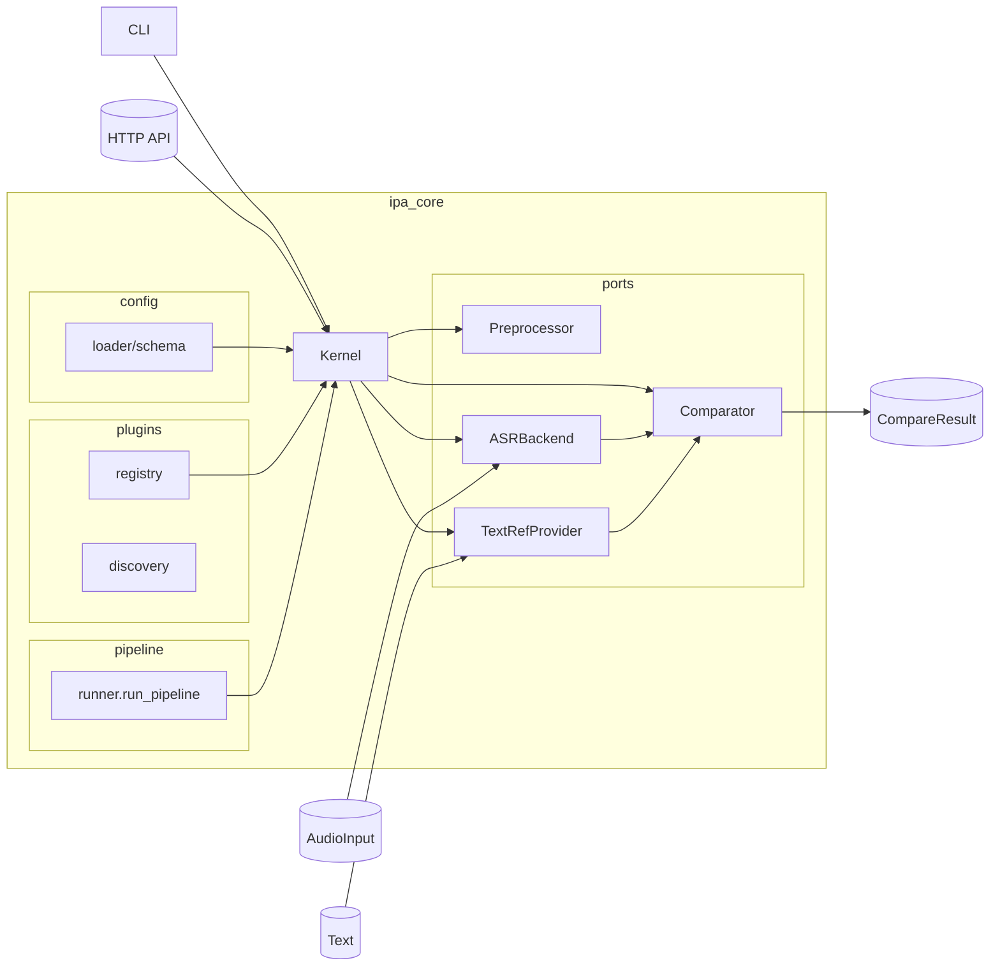

# PronunciaPA

Reconocimiento fonético (ASR + IPA) con CLI, API HTTP y un frontend listo para practicar pronunciación.

## Instalación rápida

```bash
python -m venv .venv && source .venv/bin/activate
pip install -e .[dev]
# Dependencias de audio/ASR (Allosaurus + micrófono + conversión MP3)
pip install -e .[speech]
```

> El extra `[speech]` requiere ffmpeg (para MP3/OGG/WebM) y PortAudio (para `sounddevice`).  
> Si solo quieres usar el backend stub exporta `PRONUNCIAPA_ASR=stub` y omite el extra.

## CLI

```bash
# Transcribir un WAV/MP3
pronunciapa transcribe --audio inputs/ejemplo.wav --lang es

# Grabar desde micrófono (3s por defecto)
pronunciapa transcribe --mic --seconds 4 --lang es --json
```

Variables útiles:

- `PRONUNCIAPA_ASR=allosaurus|stub`
- `PRONUNCIAPA_TEXTREF=grapheme|epitran`

## API HTTP `/pronunciapa/transcribe`

```bash
uvicorn ipa_core.api.http:get_app --reload --port 8000

curl -X POST http://localhost:8000/pronunciapa/transcribe \
  -F "lang=es" \
  -F "audio=@inputs/ejemplo.wav"
```

Respuesta tipo:

```json
{
  "ipa": "o l a",
  "tokens": ["o", "l", "a"],
  "lang": "es",
  "audio": {"path": "inputs/rec.wav", "sample_rate": 16000, "channels": 1},
  "meta": {"backend": "allosaurusasr", "tokens": 3}
}
```

## Frontend Web

El sitio Vite (`frontend/`) consume el endpoint anterior y ofrece:

- Subida de archivos WAV/MP3 + normalización automática.
- Grabación rápida desde el navegador (se convierte a WAV localmente antes de enviarse).
- Indicador de salud del backend y copia de la transcripción IPA con un clic.

Pasos:

```bash
# Ventana 1
uvicorn ipa_core.api.http:get_app --reload --port 8000

# Ventana 2
cd frontend
npm install
npm run dev -- --host
```

Abre `http://localhost:5173`. Si tu backend vive en otra URL, cambia `data-api-base` en `frontend/public/index.html` o define `window.PRONUNCIAPA_API_BASE` antes de cargar la página.

## Métricas y comparación

- `run_pipeline` coordina preprocesador → ASR → TextRef → comparador.
- El comparador de referencia es Levenshtein y produce Phone Error Rate (PER) más alineaciones (`ops`, `alignment`).
- Cuando integres dashboards puedes resaltar sustituciones/inserciones con estos resultados.

## Pruebas

```bash
PRONUNCIAPA_ASR=stub PYTHONPATH=. pytest \
  ipa_core/compare/tests/test_levenshtein.py \
  ipa_core/pipeline/tests/test_runner.py \
  ipa_core/textref/tests/test_epitran_provider.py \
  ipa_core/services/tests/test_transcription_service.py \
  ipa_core/api/tests/test_http_transcription.py \
  scripts/tests/test_cli_transcribe_stub.py \
  scripts/tests/test_preprocessor_basic.py
```

## Estructura rápida

- `ipa_core/` – kernel, servicios y puertos principales.
- `config/` – configuración YAML del microkernel.
- `frontend/` – sitio Vite/Tailwind para pruebas rápidas en navegador.
- `scripts/` – herramientas de prueba manual (WAV, CLI, etc.).
- `docs/` – backlog, plan del sprint y acuerdos de arquitectura.

## Arquitectura (mermaid)


