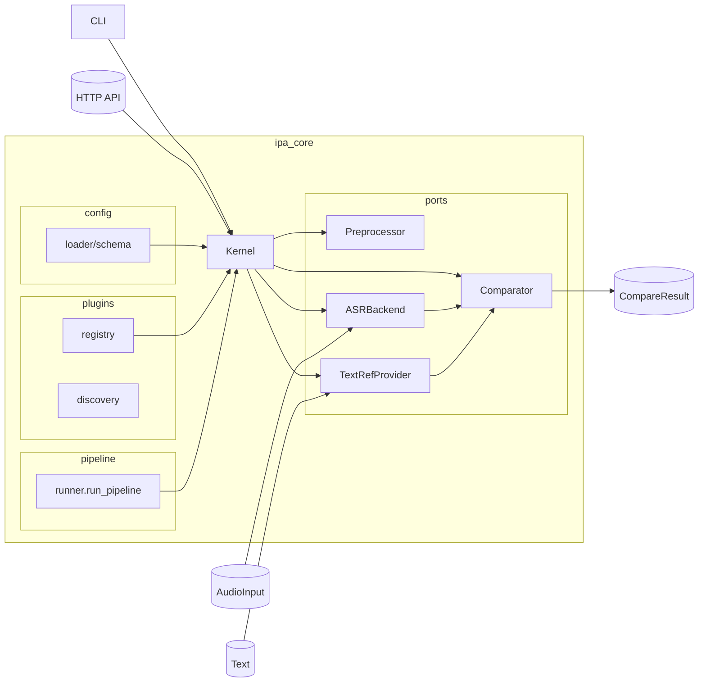

# PronunciaPA

**Microkernel de análisis fonético** para evaluación de pronunciación en cualquier idioma.

Sistema extensible mediante plugins que transforma audio en transcripciones IPA y las compara con referencias fonémicas o fonéticas, proporcionando retroalimentación precisa para mejorar la articulación.

## 🎯 Propósito

PronunciaPA permite a los usuarios elegir su objetivo de aprendizaje:
- **Nivel Fonémico** (`evaluation_level=phonemic`): Para aprender a hablar y ser entendido. Evalúa fonemas `/kasa/`.
- **Nivel Fonético** (`evaluation_level=phonetic`): Para pronunciación técnica precisa. Evalúa alófonos `[ˈka.sa]`.

El sistema utiliza **ASR → IPA directo** (no texto intermedio) para capturar la producción fonética real del usuario, sin pérdida de información alofónica.

---

## 🏗️ Arquitectura: Microkernel + Plugins

### Kernel (Core)
- Orquesta el pipeline: `Preprocessor → ASR → TextRef → Comparator`
- Valida contratos de plugins (ej: ASR debe producir IPA)
- Maneja ciclo de vida (setup/teardown)

### Plugins
- **ASR**: Convierte audio → IPA (Allosaurus, Wav2Vec2-IPA)
- **TextRef**: Convierte texto → IPA (eSpeak, Epitran)
- **Comparator**: Compara IPA observado vs target
- **LLM**: Genera ejercicios y feedback (TinyLlama, Phi) — **NO para ASR**
- **Language Packs**: Inventarios fonéticos, reglas derive/collapse

---

## 🚀 MVP Quickstart (Sin dependencias externas)

La forma más rápida de probar el sistema usando backends stub (sin modelos pesados):

### 1. Instalar dependencias básicas

```bash
python -m venv .venv && source .venv/bin/activate
pip install -e '.[dev]'  # Nota: comillas necesarias en zsh
```

### 2. Ejecutar tests para verificar instalación

```bash
python -m pytest -v
```

### 3. Lanzar el servidor HTTP

```bash
export PRONUNCIAPA_ASR=stub
export PRONUNCIAPA_TEXTREF=grapheme
uvicorn ipa_server.main:get_app --reload --port 8000
```

O con Docker:

```bash
docker-compose up
```

### 4. Probar la API con audio de muestra

```bash
# Crear archivos de audio de muestra
python scripts/create_sample_audio.py

# Transcribir audio con el cliente demo
python scripts/demo_client.py --audio data/sample/sample_es.wav --lang es

# O usar curl directamente
curl -X POST http://localhost:8000/v1/transcribe \
  -F "audio=@data/sample/sample_es.wav" \
  -F "lang=es"
```

**Respuesta esperada:**
```json
{
  "ipa": "h o l a",
  "tokens": ["h", "o", "l", "a"],
  "lang": "es",
  "meta": {"backend": "stub", "method": "grapheme"}
}
```

### 5. Frontend web (opcional)

```bash
cd frontend
npm install
npm run dev
```

Visita `http://localhost:5173` para subir audio desde el navegador.

---

## 🔧 Instalación Completa con Modelos de Producción

### Requisitos del Sistema

- Python 3.9+
- 4GB RAM mínimo (8GB recomendado con LLM)
- **Windows**: eSpeak-NG debe instalarse manualmente (ver abajo)
- **Linux/macOS**: eSpeak-NG disponible via package manager

### Paso 1: Instalar dependencias Python

```bash
# Activar entorno virtual
python -m venv .venv
source .venv/bin/activate  # En Windows: .venv\Scripts\activate

# Instalar PronunciaPA con dependencias de speech
pip install -e ".[dev,speech]"
```

### Paso 2: Instalar eSpeak-NG (TextRef provider)

#### Windows
1. Descargar instalador desde [GitHub Releases](https://github.com/espeak-ng/espeak-ng/releases)
2. Ejecutar el instalador (típicamente se instala en `C:\Program Files\eSpeak NG\`)
3. Configurar variable de entorno:
   ```powershell
   $env:PRONUNCIAPA_ESPEAK_BIN = "C:\Program Files\eSpeak NG\espeak-ng.exe"
   ```
   
   O agregar permanentemente en Variables de Sistema.

#### Linux
```bash
sudo apt-get install espeak-ng
```

#### macOS
```bash
brew install espeak-ng
```

### Paso 3: Descargar modelos de Allosaurus

```bash
# Descarga modelos básicos (Allosaurus)
python scripts/download_models.py

# Con soporte de LLM (TinyLlama)
python scripts/download_models.py --with-llms

# Con LLM más avanzado (Phi-3)
python scripts/download_models.py --with-llms --with-phi3
```

Este script:
- Descarga el modelo Allosaurus (reconocimiento fonético universal)
- Configura el cache de modelos en `~/.cache/allosaurus/`
- Opcionalmente instala modelos LLM via Ollama

### Paso 4: (Opcional) Instalar Ollama para LLM

Si quieres feedback inteligente generado por LLM:

1. Descargar e instalar Ollama desde [ollama.ai/download](https://ollama.ai/download)
2. Descargar modelo TinyLlama:
   ```bash
   ollama pull tinyllama
   ```
3. Iniciar servidor Ollama:
   ```bash
   ollama serve
   ```

### Paso 5: Configurar el sistema

Crear `configs/local.yaml` o usar variables de entorno:

```yaml
version: 1
strict_mode: false  # Auto-fallback a stubs si algo falla

backend:
  name: allosaurus  # ASR backend (requiere modelos descargados)
  params:
    lang: eng        # Idioma por defecto

textref:
  name: espeak      # Requiere eSpeak-NG instalado
  params:
    default_lang: es

llm:
  name: ollama      # Requiere Ollama corriendo
  params:
    base_url: http://localhost:11434
    model: tinyllama
```

**Variables de entorno equivalentes:**

```bash
export PRONUNCIAPA_STRICT_MODE=false
export PRONUNCIAPA_ASR=allosaurus
export PRONUNCIAPA_TEXTREF=espeak
export PRONUNCIAPA_ESPEAK_BIN="/usr/bin/espeak-ng"  # Solo si no está en PATH
```

### Paso 6: Verificar instalación

```bash
# Iniciar servidor
uvicorn ipa_server.main:get_app --reload --port 8000

# En otro terminal, verificar health
curl http://localhost:8000/health
```

**Respuesta esperada:**
```json
{
  "status": "ok",
  "version": "0.1.0",
  "strict_mode": false,
  "components": {
    "asr": {
      "name": "allosaurus",
      "ready": true,
      "output_type": "ipa"
    },
    "textref": {
      "name": "espeak",
      "ready": true
    }
  },
  "language_packs": ["en-us"],
  "local_models": 1
}
```

### Modo Strict vs Flexible

- **`strict_mode: false`** (default): Si falta un componente, usa fallback automático (stub/grapheme). Ideal para desarrollo.
- **`strict_mode: true`**: Falla inmediatamente si falta algún componente. Ideal para producción.

```bash
# Modo flexible (recomendado para empezar)
export PRONUNCIAPA_STRICT_MODE=false
uvicorn ipa_server.main:get_app --reload

# Modo estricto (producción)
export PRONUNCIAPA_STRICT_MODE=true
uvicorn ipa_server.main:get_app --reload
```

### Wizard de Configuración Automático

Al abrir el frontend (`http://localhost:5173`), si detecta componentes faltantes, mostrará automáticamente un wizard que:
- ✅ Verifica qué está instalado
- ❌ Muestra qué falta
- 📋 Proporciona comandos específicos para tu OS
- 📂 Permite copiar comandos con un click

---

## 📖 Referencia de API HTTP

### Endpoints disponibles

#### `POST /v1/transcribe` - Transcripción audio → IPA

Convierte un archivo de audio a notación IPA.

**Request:**
- `audio` (file, required): Archivo de audio (WAV, MP3, OGG, WebM)
- `lang` (string, optional): Idioma del audio (`es`, `en`, `es-mx`, `en-us`). Default: `es`
- `backend` (string, optional): Backend ASR a usar (`stub`, `allosaurus`). Default: configurado en server
- `textref` (string, optional): Proveedor texto→IPA (`grapheme`, `espeak`, `epitran`). Default: configurado en server

**Response 200:**
```json
{
  "ipa": "o l a m u n d o",
  "tokens": ["o", "l", "a", "m", "u", "n", "d", "o"],
  "lang": "es",
  "meta": {
    "backend": "stub",
    "method": "grapheme",
    "duration": 1.23
  }
}
```

**Errores:**
- `400` - Archivo inválido o faltante
- `415` - Formato de audio no soportado
- `503` - Servicio no disponible (modelos no cargados)

**Ejemplo curl:**
```bash
curl -X POST http://localhost:8000/v1/transcribe \
  -F "audio=@mi_audio.wav" \
  -F "lang=es" \
  -F "backend=stub"
```

---

#### `POST /v1/textref` - Conversión texto → IPA

Convierte texto a notación IPA usando reglas fonológicas.

**Request:**
- `text` (string, required): Texto a convertir
- `lang` (string, optional): Idioma del texto. Default: `es`
- `textref` (string, optional): Proveedor (`grapheme`, `espeak`, `epitran`). Default: `grapheme`

**Response 200:**
```json
{
  "ipa": "h o l a",
  "tokens": ["h", "o", "l", "a"],
  "lang": "es",
  "meta": {"method": "grapheme"}
}
```

**Ejemplo curl:**
```bash
curl -X POST http://localhost:8000/v1/textref \
  -F "text=hola mundo" \
  -F "lang=es" \
  -F "textref=grapheme"
```

---

#### `POST /v1/compare` - Comparación audio vs texto

Compara la pronunciación del audio contra un texto de referencia y calcula métricas de precisión.

**Request:**
- `audio` (file, required): Archivo de audio
- `text` (string, required): Texto de referencia
- `lang` (string, optional): Idioma. Default: `es`
- `mode` (string, optional): Modo de evaluación (`casual`, `objective`, `phonetic`). Default: `objective`
- `evaluation_level` (string, optional): Nivel (`phonemic`, `phonetic`). Default: `phonemic`
- `backend`, `textref`, `comparator` (optional): Overrides de plugins

**Response 200:**
```json
{
  "per": 0.0,
  "score": 100.0,
  "distance": 0,
  "operations": 4,
  "alignment": [["h", "h"], ["o", "o"], ["l", "l"], ["a", "a"]],
  "ipa": "h o l a",
  "tokens": ["h", "o", "l", "a"],
  "target": "h o l a",
  "mode": "objective",
  "evaluation_level": "phonemic",
  "meta": {"backend": "stub"}
}
```

**Métricas:**
- `per`: Phone Error Rate (0.0 = perfecto, 1.0 = completamente diferente)
- `score`: Puntuación 0-100 (100 = pronunciación perfecta)
- `distance`: Distancia de Levenshtein entre IPA observado y esperado
- `alignment`: Alineación símbolo por símbolo

**Ejemplo curl:**
```bash
curl -X POST http://localhost:8000/v1/compare \
  -F "audio=@mi_audio.wav" \
  -F "text=hola" \
  -F "lang=es" \
  -F "mode=objective"
```

---

#### `POST /v1/feedback` - Feedback pedagógico con LLM

Genera retroalimentación pedagógica personalizada usando LLMs locales (TinyLlama, Phi-3).

**Request:**
- `audio` (file, required): Archivo de audio
- `text` (string, required): Texto de referencia
- `lang` (string, optional): Idioma. Default: `es`
- `model_pack` (string, optional): Model pack LLM a usar
- `llm` (string, optional): Adapter LLM (`llama_cpp`, `onnx`, `stub`)
- `persist` (bool, optional): Guardar resultado localmente. Default: `false`

**Response 200:**
```json
{
  "feedback": "Tu pronunciación de 'hola' es clara. Trabaja en...",
  "exercises": ["Practica el sonido /o/ con 'loro', 'coro'"],
  "score": 85,
  "per": 0.15
}
```

**Nota:** Requiere modelos LLM descargados (ver sección de modelos).

---

#### `GET /health` - Health check

Verifica que el servidor está funcionando.

**Response 200:**
```json
{
  "status": "ok"
}
```

---

## 📦 Instalación completa (con modelos)

Para usar modelos reales de ASR (Allosaurus) en lugar de stubs:

```bash
# Instalar dependencias de audio y ASR
pip install -e .[dev,speech]

# Instalar ffmpeg y eSpeak (Ubuntu/Debian)
sudo apt-get install ffmpeg espeak-ng

# Descargar modelos
python scripts/download_models.py

# Lanzar servidor con Allosaurus
export PRONUNCIAPA_ASR=allosaurus
export PRONUNCIAPA_TEXTREF=espeak
uvicorn ipa_server.main:get_app --reload --port 8000
```

---

## 📦 Instalación rápida

```bash
python -m venv .venv && source .venv/bin/activate
pip install -e '.[dev]'
# Dependencias de audio/ASR (Allosaurus + micrófono + conversión MP3/OGG/WebM)
pip install -e '.[speech]'
```

> **Nota para zsh:** Las comillas son necesarias para evitar el error "no matches found".  
> El extra `[speech]` requiere ffmpeg (para MP3/OGG/WebM) y PortAudio (para `sounddevice`).  
> Si solo necesitas el stub exporta `PRONUNCIAPA_ASR=stub` y omite el extra.

---

## 🔽 Descarga de modelos

### Mínimo requerido (ASR → IPA)

```bash
# Descarga solo lo esencial: Allosaurus (ASR→IPA) + eSpeak (G2P)
python scripts/download_models.py
```

### Opcionales

```bash
# LLMs para ejercicios y feedback (NO para ASR)
python scripts/download_models.py --with-llms

# Incluir Phi-3 (LLM alternativo, más capaz)
python scripts/download_models.py --with-llms --with-phi3

# ASR alternativo: Wav2Vec2 IPA (requiere token HF si es gated)
export HUGGINGFACEHUB_API_TOKEN=hf_XXXX
python scripts/download_models.py --wav2vec2-ipa-model facebook/wav2vec2-large-xlsr-53-ipa
```

### ⚠️ Modelos NO recomendados

**Modelos que producen TEXTO** (no IPA) pierden información de alófonos:
- `facebook/wav2vec2-large-xlsr-53` (texto multilingüe)
- `jonatasgrosman/wav2vec2-large-xlsr-53-*` (texto por idioma)
- Vosk, Whisper (útiles para transcripción, no análisis fonético)

**Usa Allosaurus** (IPA universal, 2000+ lenguas) o modelos Wav2Vec2 fine-tuned para IPA.

---

## 🎮 CLI

```bash
# Transcribir un WAV/MP3
pronunciapa transcribe --audio inputs/ejemplo.wav --lang es

# Grabar desde micrófono (3 s por defecto)
pronunciapa transcribe --mic --seconds 4 --lang es --json

# Elegir proveedor texto→IPA
pronunciapa transcribe --audio inputs/ejemplo.mp3 --textref epitran
pronunciapa transcribe --audio inputs/ejemplo.wav --textref espeak
```

### Gestión de Plugins

PronunciaPA utiliza una arquitectura de microkernel extensible mediante plugins. Puedes gestionarlos directamente desde el CLI:

```bash
# Listar plugins instalados, su versión y autor
pronunciapa plugin list

# Ver detalles de un plugin específico
pronunciapa plugin inspect asr stub

# Validar que los plugins instalados cumplen con el contrato
pronunciapa plugin validate

# Instalar un nuevo plugin (vía pip)
pronunciapa plugin install nombre-del-paquete

# Desinstalar un plugin
pronunciapa plugin uninstall nombre-del-paquete
```

Variables útiles:

- `PRONUNCIAPA_ASR=allosaurus|stub`
- `PRONUNCIAPA_TEXTREF=grapheme|epitran|espeak`
- `PRONUNCIAPA_ESPEAK_BIN=/ruta/a/espeak-ng` (opcional cuando el binario no está en el PATH)

Si seleccionas `epitran` y la librería no está instalada, el servicio cambia automáticamente a `espeak` para mantener la experiencia del usuario.

## API HTTP `/v1/transcribe`

```bash
uvicorn ipa_server.main:get_app --reload --port 8000
```

Enviar archivos:

```bash
curl -X POST http://localhost:8000/v1/transcribe \
  -F "lang=es" \
  -F "audio=@inputs/ejemplo.wav"
```

Streaming de bytes crudos:

```bash
curl -X POST http://localhost:8000/v1/transcribe \
  -H "Content-Type: application/octet-stream" \
  --data-binary @inputs/ejemplo.wav
```

Respuesta tipo:

```json
{
  "ipa": "o l a",
  "tokens": ["o", "l", "a"],
  "lang": "es",
  "audio": {"path": "inputs/rec.wav", "sample_rate": 16000, "channels": 1},
  "meta": {"backend": "allosaurusasr", "tokens": 3}
}
```

## API HTTP `/v1/textref`

```bash
curl -X POST http://localhost:8000/v1/textref \
  -F "lang=es" \
  -F "text=hola"
```

Respuesta tipo:

```json
{
  "ipa": "h o l a",
  "tokens": ["h", "o", "l", "a"],
  "lang": "es",
  "meta": {"method": "grapheme"}
}
```

## Frontend Web

El sitio Vite (`frontend/`) consume la API y expone:

- Subida de audio con validaciones básicas.
- Grabación desde el navegador (se convierte a WAV local antes de enviarse).
- Estado del backend y botón para copiar la transcripción IPA.

Pasos:

```bash
# Ventana 1
uvicorn ipa_server.main:get_app --reload --port 8000

# Ventana 2
cd frontend
npm install
npm run dev -- --host
```

Visita `http://localhost:5173`. Si tu backend vive en otra URL ajusta `data-api-base` en `frontend/public/index.html` o define `window.PRONUNCIAPA_API_BASE` antes de cargar la página.

## Mobile App (Flutter)

El cliente móvil (`pronunciapa_client/`) permite evaluar pronunciación desde Android/iOS:

- Grabación de audio con micrófono
- Transcripción a IPA
- Comparación con referencia

```bash
cd pronunciapa_client
flutter pub get
flutter run -d android  # o -d ios
```

> **⚠️ Alpha**: El cliente móvil está en desarrollo activo. Ver [`pronunciapa_client/README.md`](pronunciapa_client/README.md) para detalles.

## Docker (demo rápida)

Construir imagen del backend (por defecto usa el ASR `stub`):

```bash
docker build -t pronunciapa-api .
docker run --rm -p 8000:8000 -e PRONUNCIAPA_ASR=stub pronunciapa-api
```

Modo detach (ideal para demo):

```bash
docker run -d --name pronunciapa-api -p 8000:8000 -e PRONUNCIAPA_ASR=stub pronunciapa-api
# Parar y remover
docker stop pronunciapa-api && docker rm pronunciapa-api
```

Con `docker-compose` (recomendado):

```bash
docker compose up --build -d
# Logs
docker compose logs -f api
# Detener
docker compose down
```

Extras de audio (opcional): si quieres Epitran/eSpeak y soporte MP3 dentro del contenedor, construye con:

```bash
docker build -t pronunciapa-api --build-arg WITH_SPEECH=true .
docker run --rm -p 8000:8000 -e PRONUNCIAPA_TEXTREF=epitran pronunciapa-api
```

Prueba rápida en Docker:

```bash
curl -X POST http://localhost:8000/v1/transcribe \
  -F "lang=es" \
  -F "audio=@inputs/ejemplo.wav"
```

## Métricas y comparación

- `run_pipeline` coordina preprocesador → ASR → TextRef → comparador.
- El comparador de referencia es Levenshtein (PER + alineación con detalle de operaciones).
- Exporta resultados (`ops`, `alignment`, `meta`) listos para dashboards o reportes.

## Pruebas

PronunciaPA utiliza una estrategia de pruebas por capas:

1.  **Unitarias (FIST):** Pruebas rápidas de lógica pura.
    ```bash
    pytest ipa_core/compare/tests/test_levenshtein.py
    ```
2.  **Contratos:** Verificación de cumplimiento de protocolos para plugins.
    ```bash
    pytest plugins/allosaurus/tests/test_asr_allosaurus.py
    ```
3.  **Integración:** Orquestación del Kernel con stubs.
    ```bash
    pytest ipa_core/tests/integration/
    ```
4.  **Performance:** Benchmarks de latencia y RTF.
    ```bash
    pytest ipa_core/tests/performance/
    ```
5.  **Smoke:** Verificación rápida de interfaces (CLI/API).
    ```bash
    pytest ipa_core/interfaces/tests/test_cli_smoke.py
    pytest ipa_server/tests/test_api_smoke.py
    ```

Correr todas las pruebas:
```bash
PYTHONPATH=. python -m pytest
```

Atajos disponibles:
```bash
make test-unit  # unitarias + integración rápida
make test-int   # integración completa con stubs
```

## Estructura

- `ipa_core/` – Núcleo Microkernel (ligero).
- `plugins/` - Adaptadores externos (p. ej. Allosaurus).
- `ipa_server/` - Servidor HTTP independiente.
- `frontend/` – Landing + demo conectada a la API.
- `scripts/` – Herramientas de prueba manual.
- `docs/` – Backlog, arquitectura y planes de sprint.

## Arquitectura (mermaid)




---

## 🔧 Troubleshooting

### El servidor no arranca

**Error: "Address already in use"**
```bash
# El puerto 8000 está ocupado, usa otro puerto
uvicorn ipa_server.main:get_app --port 8001
```

**Error: "No se encontró espeak ni espeak-ng"**
```bash
# Opción 1: Instalar eSpeak
sudo apt-get install espeak-ng  # Ubuntu/Debian
brew install espeak             # macOS

# Opción 2: Usar backend stub para testing
export PRONUNCIAPA_ASR=stub
export PRONUNCIAPA_TEXTREF=grapheme
```

**Error: "Pack manifest not found for: model/..."**
```bash
# El config tiene un model_pack que no existe
# Usa variables de entorno para overridear:
export PRONUNCIAPA_CONFIG=""  # No cargar config local
export PRONUNCIAPA_ASR=stub
export PRONUNCIAPA_TEXTREF=grapheme
```

### Los tests fallan

**"pytest: command not found"** o **"zsh: no matches found: .[dev]"**
```bash
# Instala las dependencias de desarrollo (comillas necesarias en zsh)
pip install -e '.[dev]'
```

**"Import pytest could not be resolved"**
- Es un warning del linter, no afecta la ejecución
- Los tests corren correctamente con `python -m pytest`

**Tests HTTP fallan con 503**
- Verifica que tengas configurado `PRONUNCIAPA_ASR=stub` y `PRONUNCIAPA_TEXTREF=grapheme`
- El conftest de `ipa_server/tests/conftest.py` debería manejar esto automáticamente

### Docker no funciona

**"Cannot connect to Docker daemon"**
```bash
# Inicia el servicio Docker
sudo systemctl start docker  # Linux
# O inicia Docker Desktop en Windows/macOS
```

**Contenedor se reinicia continuamente**
```bash
# Ver logs
docker-compose logs -f

# Verificar que el Dockerfile tiene las deps correctas
docker-compose build --no-cache
```

### Frontend no se conecta al backend

**Error CORS en el navegador**
```bash
# Configura CORS en el servidor
export PRONUNCIAPA_ALLOWED_ORIGINS="http://localhost:5173,http://localhost:3000"
# O usa DEBUG mode (permite *)
export DEBUG=1
```

**"Failed to fetch"**
- Verifica que el servidor esté corriendo en `http://localhost:8000`
- Prueba el endpoint manualmente: `curl http://localhost:8000/health`
- Abre `frontend/public/app.html` y verifica la URL en API_BASE

### Audio no se transcribe correctamente

**Usando stub backend**
- El backend stub siempre retorna `["h", "o", "l", "a"]` para testing
- Para transcripciones reales, usa `PRONUNCIAPA_ASR=allosaurus`

**Con Allosaurus**
```bash
# Verifica que el modelo esté descargado
python -c "from allosaurus.app import read_recognizer; read_recognizer(\"uni2005\")"

# Si falla, descarga manualmente
python scripts/download_models.py
```

**Formato de audio no soportado**
- Instala ffmpeg: `sudo apt-get install ffmpeg`
- Convierte tu audio: `ffmpeg -i input.mp3 -ar 16000 -ac 1 output.wav`

### Rendimiento lento

**Primera ejecución es lenta**
- Allosaurus carga el modelo en memoria (puede tomar 10-30s)
- Ejecuciones posteriores son más rápidas

**Uso de memoria alto**
- Allosaurus uni2005 requiere ~2GB RAM
- Considera usar el stub backend para desarrollo
- En producción, usa un servidor con mínimo 4GB RAM

### Problemas con modelos LLM

**Error: "LLM not available"**
- Los LLMs son opcionales y solo necesarios para `/v1/feedback`
- Endpoints básicos (`/v1/transcribe`, `/v1/compare`) no los requieren

**Descargar modelos LLM**
```bash
python scripts/download_models.py --with-llms
```

---

## 📝 Contribuir

Para contribuir al proyecto:

1. Fork el repositorio
2. Crea una rama: `git checkout -b feature/nueva-funcionalidad`
3. Ejecuta los tests: `python -m pytest`
4. Commit tus cambios: `git commit -am "Agregar nueva funcionalidad"`
5. Push a la rama: `git push origin feature/nueva-funcionalidad`
6. Abre un Pull Request

Ver `docs/CONTRIBUTING_BRANCHES.md` para más detalles sobre el flujo de trabajo.

---

## 📄 Licencia

Este proyecto está bajo la licencia MIT. Ver el archivo `LICENSE` para más detalles.

---

## 🙏 Agradecimientos

- **Allosaurus**: Sistema ASR multilingüe que produce IPA directo
- **eSpeak-NG**: Motor de síntesis de voz y conversión G2P
- **FastAPI**: Framework web moderno para Python
- **Vite + Tailwind**: Herramientas para el frontend

---

## 📧 Contacto

Para preguntas, issues o sugerencias:
- GitHub Issues: https://github.com/Pedro-Samuel-Rodriguez-Caudillo/PronunciaPA/issues
- Documentación: Ver carpeta `docs/`


