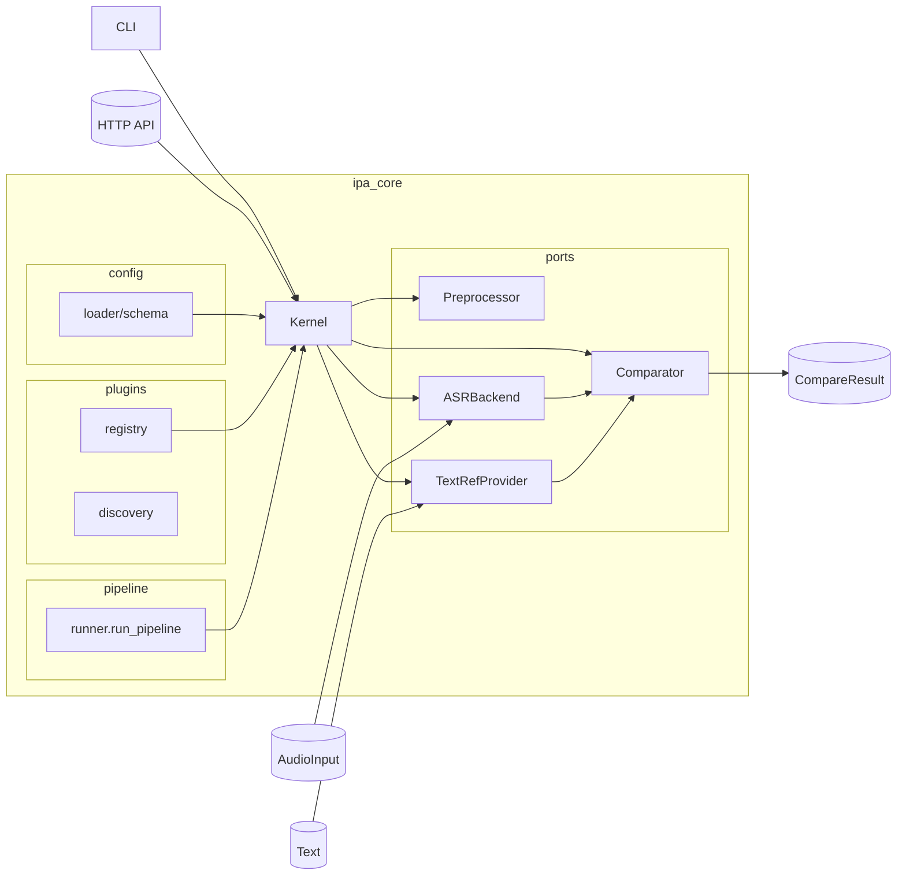

# PronunciaPA

Reconocimiento fonético (ASR + IPA) con CLI, API HTTP y un frontend listo para que cualquier persona pruebe su pronunciación.

## Instalación rápida

```bash
python -m venv .venv && source .venv/bin/activate
pip install -e .[dev]
# Dependencias de audio/ASR (Allosaurus + micrófono + conversión MP3/OGG/WebM)
pip install -e .[speech]
```

> El extra `[speech]` requiere ffmpeg (para MP3/OGG/WebM) y PortAudio (para `sounddevice`).  
> Si solo necesitas el stub exporta `PRONUNCIAPA_ASR=stub` y omite el extra.

## CLI

```bash
# Transcribir un WAV/MP3
pronunciapa transcribe --audio inputs/ejemplo.wav --lang es

# Grabar desde micrófono (3 s por defecto)
pronunciapa transcribe --mic --seconds 4 --lang es --json

# Elegir proveedor texto→IPA
pronunciapa transcribe --audio inputs/ejemplo.mp3 --textref epitran
pronunciapa transcribe --audio inputs/ejemplo.wav --textref espeak
```

Variables útiles:

- `PRONUNCIAPA_ASR=allosaurus|stub`
- `PRONUNCIAPA_TEXTREF=grapheme|epitran|espeak`
- `PRONUNCIAPA_ESPEAK_BIN=/ruta/a/espeak-ng` (opcional cuando el binario no está en el PATH)

Si seleccionas `epitran` y la librería no está instalada, el servicio cambia automáticamente a `espeak` para mantener la experiencia del usuario.

## API HTTP `/pronunciapa/transcribe`

```bash
uvicorn ipa_core.api.http:get_app --reload --port 8000
```

Enviar archivos:

```bash
curl -X POST http://localhost:8000/pronunciapa/transcribe \
  -F "lang=es" \
  -F "audio=@inputs/ejemplo.wav"
```

Streaming de bytes crudos:

```bash
curl -X POST http://localhost:8000/pronunciapa/transcribe \
  -H "Content-Type: application/octet-stream" \
  --data-binary @inputs/ejemplo.wav
```

Respuesta tipo:

```json
{
  "ipa": "o l a",
  "tokens": ["o", "l", "a"],
  "lang": "es",
  "audio": {"path": "inputs/rec.wav", "sample_rate": 16000, "channels": 1},
  "meta": {"backend": "allosaurusasr", "tokens": 3}
}
```

## Frontend Web

El sitio Vite (`frontend/`) consume la API y expone:

- Subida de audio con validaciones básicas.
- Grabación desde el navegador (se convierte a WAV local antes de enviarse).
- Estado del backend y botón para copiar la transcripción IPA.

Pasos:

```bash
# Ventana 1
uvicorn ipa_core.api.http:get_app --reload --port 8000

# Ventana 2
cd frontend
npm install
npm run dev -- --host
```

Visita `http://localhost:5173`. Si tu backend vive en otra URL ajusta `data-api-base` en `frontend/public/index.html` o define `window.PRONUNCIAPA_API_BASE` antes de cargar la página.

## Docker (demo rápida)

Construir imagen del backend (por defecto usa el ASR `stub`):

```bash
docker build -t pronunciapa-api .
docker run --rm -p 8000:8000 -e PRONUNCIAPA_ASR=stub pronunciapa-api
```

Modo detach (ideal para demo):

```bash
docker run -d --name pronunciapa-api -p 8000:8000 -e PRONUNCIAPA_ASR=stub pronunciapa-api
# Parar y remover
docker stop pronunciapa-api && docker rm pronunciapa-api
```

Con `docker-compose` (recomendado):

```bash
docker compose up --build -d
# Logs
docker compose logs -f api
# Detener
docker compose down
```

Extras de audio (opcional): si quieres Epitran/eSpeak y soporte MP3 dentro del contenedor, construye con:

```bash
docker build -t pronunciapa-api --build-arg WITH_SPEECH=true .
docker run --rm -p 8000:8000 -e PRONUNCIAPA_TEXTREF=epitran pronunciapa-api
```

Prueba rápida en Docker:

```bash
curl -X POST http://localhost:8000/pronunciapa/transcribe \
  -F "lang=es" \
  -F "audio=@inputs/ejemplo.wav"
```

## Métricas y comparación

- `run_pipeline` coordina preprocesador → ASR → TextRef → comparador.
- El comparador de referencia es Levenshtein (PER + alineación con detalle de operaciones).
- Exporta resultados (`ops`, `alignment`, `meta`) listos para dashboards o reportes.

## Pruebas

```bash
PRONUNCIAPA_ASR=stub PYTHONPATH=. pytest \
  ipa_core/compare/tests/test_levenshtein.py \
  ipa_core/pipeline/tests/test_runner.py \
  ipa_core/textref/tests/test_epitran_provider.py \
  ipa_core/services/tests/test_transcription_service.py \
  ipa_core/api/tests/test_http_transcription.py \
  scripts/tests/test_cli_transcribe_stub.py \
  scripts/tests/test_preprocessor_basic.py
```

Atajos disponibles:

```bash
make test-unit  # pruebas AAA rápidas (FIST) en módulos Python puros
make test-int   # pruebas de integración CLI/API con stubs
```

## Estructura rápida

- `ipa_core/` – kernel, servicios y puertos.
- `config/` – YAML del microkernel.
- `frontend/` – landing + demo conectada a la API.
- `scripts/` – herramientas de prueba manual.
- `docs/` – backlog, plan del sprint y acuerdos de arquitectura.

## Arquitectura (mermaid)


