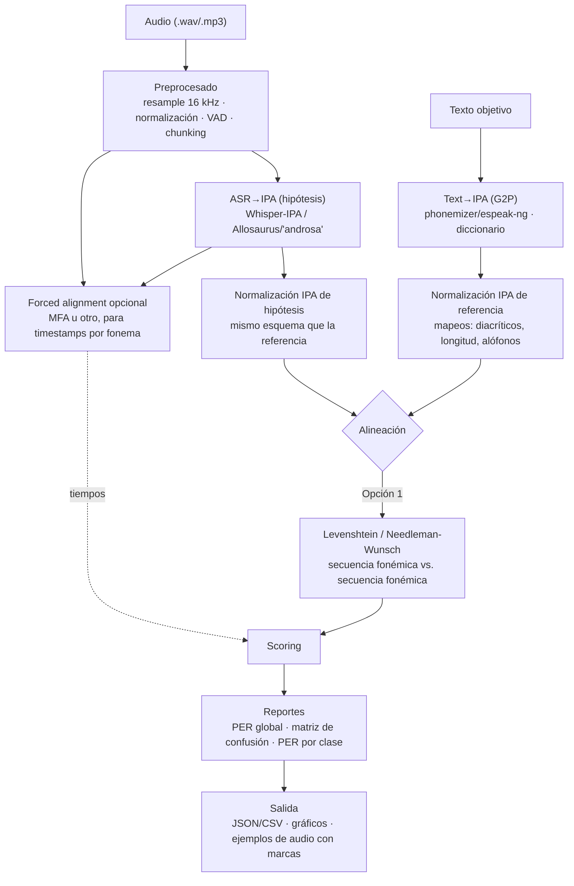

# IPA Core
No tiene logica

## Objetivo
- Nucleo que orquesta:
  1) Backend ASR (audio a IPA),
  2) Conversor de texto a IPA (TextRef),
  3) Comparador (IPA vs IPA).
- Extensible con plugins sin tocar el nucleo.

## Estructura
ipa_core/
  api/        # CLI y futura API
  backends/   # ASR (vozIPA)
  compare/    # Comparacion de cadenas IPA
  textref/    # TextoIPA (G2P)
  kernel.py   # Orquestacion de plugins
  plugins.py  # Carga de entry points

### api/
- cli.py: comandos `ipa plugins` y `ipa run` basados en Typer.

### backends/
- base.py: interfaz ASRBackend.transcribe_ipa(audio_path) -> str
- null_backend.py: stub de prueba.
- whisper_ipa.py: stub para Whisper-IPA.

### compare/
- base.py: interfaz Comparator.compare(...) -> CompareResult
- noop.py: stub (PER=0, sin ops).

### textref/
- base.py: interfaz TextRef.text_to_ipa(text, lang) -> str
- phonemizer_ref.py: conversor real usando phonemizer/espeak-ng.
- noop.py: stub de prueba.

### Nucleo
- kernel.py: instancia plugins segun KernelConfig.
- plugins.py: carga por entry points.

## Pipeline


## Configuración del kernel

Consulte [`docs/kernel.md`](docs/kernel.md) para la guía detallada sobre la
configuración (`KernelConfig`), gestión de plugins y uso del CLI stub.

## Dependencias externas

Para que el conversor de texto a IPA funcione con toda su capacidad es
necesario instalar los binarios de `espeak-ng` además de las dependencias
Python del proyecto. En Debian/Ubuntu:

```bash
sudo apt-get install espeak-ng
```

Luego instala las dependencias Python (incluido `phonemizer`):

```bash
pip install -e .
```

Para automatizar la preparación del entorno (dependencias de Python y descarga del
modelo Whisper-IPA) puedes ejecutar:

```bash
./scripts/install_models.sh
```

Este script verificará si `espeak-ng` está instalado y descargará el modelo
`neurlang/ipa-whisper-base` al caché local de Hugging Face.

> Nota: si `phonemizer` no está disponible el plugin incluye un fallback muy
> básico para pruebas que solo cubre algunos ejemplos en español e inglés.

## API HTTP y frontend

El módulo `ipa_core.api.server` expone una API HTTP basada en FastAPI que se
integra con el frontend estático incluido en `frontend/public/`. Para probar el
flujo completo:

1. Inicia el backend:

   ```bash
   uvicorn ipa_core.api.server:app --host 0.0.0.0 --port 8000
   ```

2. Sirve el frontend (por ejemplo usando el script disponible en `package.json`):

   ```bash
   cd frontend
   npm run start
   ```

3. Abre `http://localhost:3000` en tu navegador y utiliza la sección "Conecta
   con el núcleo IPA" para subir un audio y visualizar las métricas generadas
   por el backend.

## Datos de ejemplo

El repositorio incluye un dataset mínimo en `data/sample/` con tres pares
audio-texto pensado para validar el pipeline localmente. Los archivos WAV no se
versionan; genéralos cuando los necesites con:

```bash
python scripts/generate_sample_dataset.py
```

La documentación del formato y los scripts auxiliares están descritos en
[`docs/data.md`](docs/data.md).

## Proximos pasos
- Implementar backend ASR real (Whisper-IPA y/o Allosaurus).
- Anadir comparador Levenshtein y PER.
