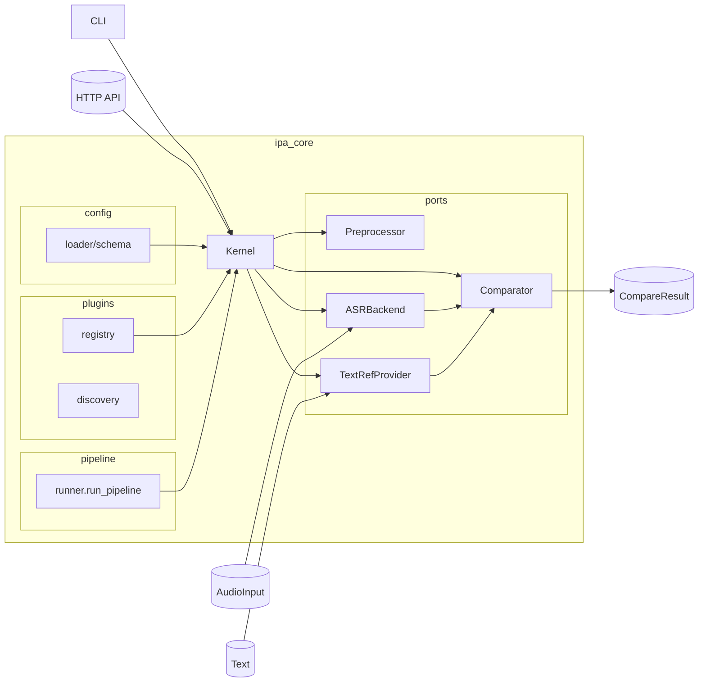

# PronunciaPA

**Microkernel de análisis fonético** para evaluación de pronunciación en cualquier idioma.

Sistema extensible mediante plugins que transforma audio en transcripciones IPA y las compara con referencias fonémicas o fonéticas, proporcionando retroalimentación precisa para mejorar la articulación.

## 🎯 Propósito

PronunciaPA permite a los usuarios elegir su objetivo de aprendizaje:
- **Nivel Fonémico** (`evaluation_level=phonemic`): Para aprender a hablar y ser entendido. Evalúa fonemas `/kasa/`.
- **Nivel Fonético** (`evaluation_level=phonetic`): Para pronunciación técnica precisa. Evalúa alófonos `[ˈka.sa]`.

El sistema utiliza **ASR → IPA directo** (no texto intermedio) para capturar la producción fonética real del usuario, sin pérdida de información alofónica.

---

## 🏗️ Arquitectura: Microkernel + Plugins

### Kernel (Core)
- Orquesta el pipeline: `Preprocessor → ASR → TextRef → Comparator`
- Valida contratos de plugins (ej: ASR debe producir IPA)
- Maneja ciclo de vida (setup/teardown)

### Plugins
- **ASR**: Convierte audio → IPA (Allosaurus, Wav2Vec2-IPA)
- **TextRef**: Convierte texto → IPA (eSpeak, Epitran)
- **Comparator**: Compara IPA observado vs target
- **LLM**: Genera ejercicios y feedback (TinyLlama, Phi) — **NO para ASR**
- **Language Packs**: Inventarios fonéticos, reglas derive/collapse

---

## 📦 Instalación rápida

```bash
python -m venv .venv && source .venv/bin/activate
pip install -e .[dev]
# Dependencias de audio/ASR (Allosaurus + micrófono + conversión MP3/OGG/WebM)
pip install -e .[speech]
```

> El extra `[speech]` requiere ffmpeg (para MP3/OGG/WebM) y PortAudio (para `sounddevice`).  
> Si solo necesitas el stub exporta `PRONUNCIAPA_ASR=stub` y omite el extra.

---

## 🔽 Descarga de modelos

### Mínimo requerido (ASR → IPA)

```bash
# Descarga solo lo esencial: Allosaurus (ASR→IPA) + eSpeak (G2P)
python scripts/download_models.py
```

### Opcionales

```bash
# LLMs para ejercicios y feedback (NO para ASR)
python scripts/download_models.py --with-llms

# Incluir Phi-3 (LLM alternativo, más capaz)
python scripts/download_models.py --with-llms --with-phi3

# ASR alternativo: Wav2Vec2 IPA (requiere token HF si es gated)
export HUGGINGFACEHUB_API_TOKEN=hf_XXXX
python scripts/download_models.py --wav2vec2-ipa-model facebook/wav2vec2-large-xlsr-53-ipa
```

### ⚠️ Modelos NO recomendados

**Modelos que producen TEXTO** (no IPA) pierden información de alófonos:
- `facebook/wav2vec2-large-xlsr-53` (texto multilingüe)
- `jonatasgrosman/wav2vec2-large-xlsr-53-*` (texto por idioma)
- Vosk, Whisper (útiles para transcripción, no análisis fonético)

**Usa Allosaurus** (IPA universal, 2000+ lenguas) o modelos Wav2Vec2 fine-tuned para IPA.

---

## 🎮 CLI

```bash
# Transcribir un WAV/MP3
pronunciapa transcribe --audio inputs/ejemplo.wav --lang es

# Grabar desde micrófono (3 s por defecto)
pronunciapa transcribe --mic --seconds 4 --lang es --json

# Elegir proveedor texto→IPA
pronunciapa transcribe --audio inputs/ejemplo.mp3 --textref epitran
pronunciapa transcribe --audio inputs/ejemplo.wav --textref espeak
```

### Gestión de Plugins

PronunciaPA utiliza una arquitectura de microkernel extensible mediante plugins. Puedes gestionarlos directamente desde el CLI:

```bash
# Listar plugins instalados, su versión y autor
pronunciapa plugin list

# Ver detalles de un plugin específico
pronunciapa plugin inspect asr stub

# Validar que los plugins instalados cumplen con el contrato
pronunciapa plugin validate

# Instalar un nuevo plugin (vía pip)
pronunciapa plugin install nombre-del-paquete

# Desinstalar un plugin
pronunciapa plugin uninstall nombre-del-paquete
```

Variables útiles:

- `PRONUNCIAPA_ASR=allosaurus|stub`
- `PRONUNCIAPA_TEXTREF=grapheme|epitran|espeak`
- `PRONUNCIAPA_ESPEAK_BIN=/ruta/a/espeak-ng` (opcional cuando el binario no está en el PATH)

Si seleccionas `epitran` y la librería no está instalada, el servicio cambia automáticamente a `espeak` para mantener la experiencia del usuario.

## API HTTP `/v1/transcribe`

```bash
uvicorn ipa_server.main:get_app --reload --port 8000
```

Enviar archivos:

```bash
curl -X POST http://localhost:8000/v1/transcribe \
  -F "lang=es" \
  -F "audio=@inputs/ejemplo.wav"
```

Streaming de bytes crudos:

```bash
curl -X POST http://localhost:8000/v1/transcribe \
  -H "Content-Type: application/octet-stream" \
  --data-binary @inputs/ejemplo.wav
```

Respuesta tipo:

```json
{
  "ipa": "o l a",
  "tokens": ["o", "l", "a"],
  "lang": "es",
  "audio": {"path": "inputs/rec.wav", "sample_rate": 16000, "channels": 1},
  "meta": {"backend": "allosaurusasr", "tokens": 3}
}
```

## API HTTP `/v1/textref`

```bash
curl -X POST http://localhost:8000/v1/textref \
  -F "lang=es" \
  -F "text=hola"
```

Respuesta tipo:

```json
{
  "ipa": "h o l a",
  "tokens": ["h", "o", "l", "a"],
  "lang": "es",
  "meta": {"method": "grapheme"}
}
```

## Frontend Web

El sitio Vite (`frontend/`) consume la API y expone:

- Subida de audio con validaciones básicas.
- Grabación desde el navegador (se convierte a WAV local antes de enviarse).
- Estado del backend y botón para copiar la transcripción IPA.

Pasos:

```bash
# Ventana 1
uvicorn ipa_server.main:get_app --reload --port 8000

# Ventana 2
cd frontend
npm install
npm run dev -- --host
```

Visita `http://localhost:5173`. Si tu backend vive en otra URL ajusta `data-api-base` en `frontend/public/index.html` o define `window.PRONUNCIAPA_API_BASE` antes de cargar la página.

## Docker (demo rápida)

Construir imagen del backend (por defecto usa el ASR `stub`):

```bash
docker build -t pronunciapa-api .
docker run --rm -p 8000:8000 -e PRONUNCIAPA_ASR=stub pronunciapa-api
```

Modo detach (ideal para demo):

```bash
docker run -d --name pronunciapa-api -p 8000:8000 -e PRONUNCIAPA_ASR=stub pronunciapa-api
# Parar y remover
docker stop pronunciapa-api && docker rm pronunciapa-api
```

Con `docker-compose` (recomendado):

```bash
docker compose up --build -d
# Logs
docker compose logs -f api
# Detener
docker compose down
```

Extras de audio (opcional): si quieres Epitran/eSpeak y soporte MP3 dentro del contenedor, construye con:

```bash
docker build -t pronunciapa-api --build-arg WITH_SPEECH=true .
docker run --rm -p 8000:8000 -e PRONUNCIAPA_TEXTREF=epitran pronunciapa-api
```

Prueba rápida en Docker:

```bash
curl -X POST http://localhost:8000/v1/transcribe \
  -F "lang=es" \
  -F "audio=@inputs/ejemplo.wav"
```

## Métricas y comparación

- `run_pipeline` coordina preprocesador → ASR → TextRef → comparador.
- El comparador de referencia es Levenshtein (PER + alineación con detalle de operaciones).
- Exporta resultados (`ops`, `alignment`, `meta`) listos para dashboards o reportes.

## Pruebas

PronunciaPA utiliza una estrategia de pruebas por capas:

1.  **Unitarias (FIST):** Pruebas rápidas de lógica pura.
    ```bash
    pytest ipa_core/compare/tests/test_levenshtein.py
    ```
2.  **Contratos:** Verificación de cumplimiento de protocolos para plugins.
    ```bash
    pytest plugins/allosaurus/tests/test_asr_allosaurus.py
    ```
3.  **Integración:** Orquestación del Kernel con stubs.
    ```bash
    pytest ipa_core/tests/integration/
    ```
4.  **Performance:** Benchmarks de latencia y RTF.
    ```bash
    pytest ipa_core/tests/performance/
    ```
5.  **Smoke:** Verificación rápida de interfaces (CLI/API).
    ```bash
    pytest ipa_core/interfaces/tests/test_cli_smoke.py
    pytest ipa_server/tests/test_api_smoke.py
    ```

Correr todas las pruebas:
```bash
PYTHONPATH=. python -m pytest
```

Atajos disponibles:
```bash
make test-unit  # unitarias + integración rápida
make test-int   # integración completa con stubs
```

## Estructura

- `ipa_core/` – Núcleo Microkernel (ligero).
- `plugins/` - Adaptadores externos (p. ej. Allosaurus).
- `ipa_server/` - Servidor HTTP independiente.
- `frontend/` – Landing + demo conectada a la API.
- `scripts/` – Herramientas de prueba manual.
- `docs/` – Backlog, arquitectura y planes de sprint.

## Arquitectura (mermaid)


