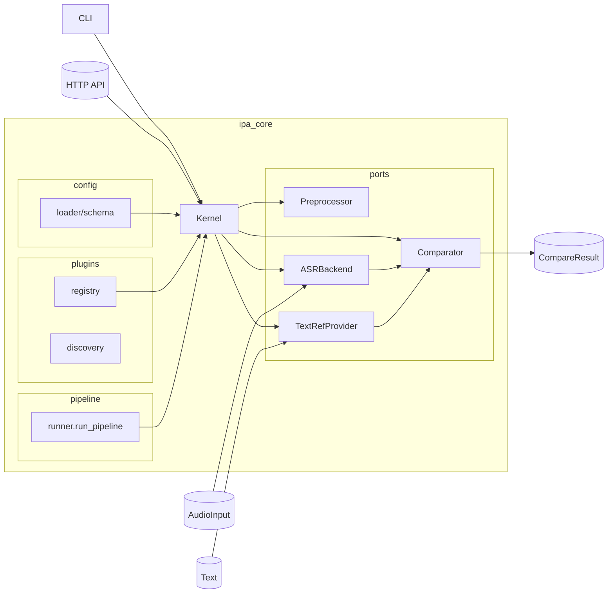

# PronunciaPA

Estructura principal (sujeta a ajustes durante el diseño):

- `ipa_core/` (núcleo y plugins; sin implementación por ahora)
- `configs/` y `config/` (plantillas vacías con TODOs)
- `scripts/` (sin lógica; TODOs)
- `frontend/` (sin implementación; TODOs)
- `docs/backlog.md` y `**/TODO.md` (únicas fuentes de verdad por ahora)

Arquitectura (mermaid)
----------------------

