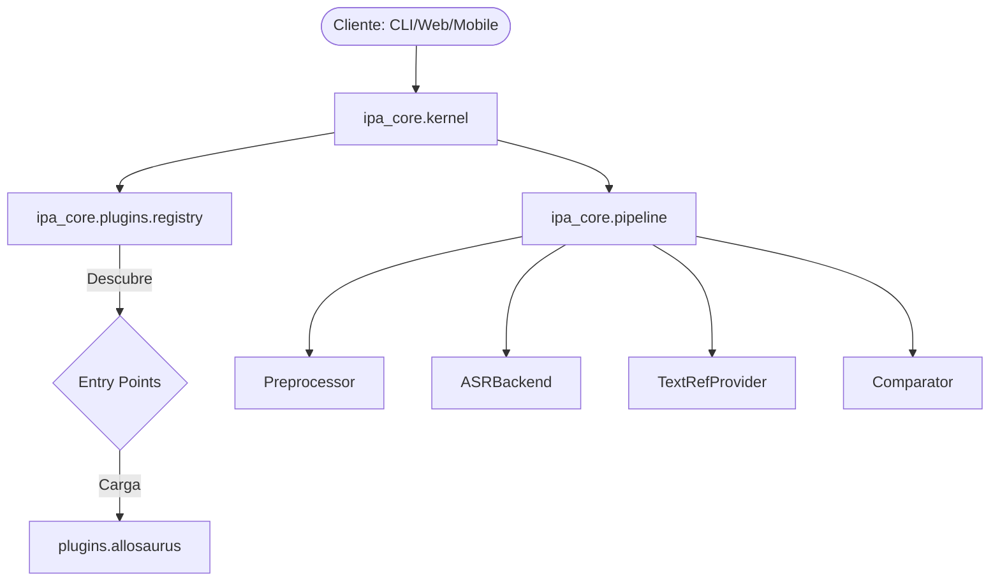

# Arquitectura: PronunciaPA Microkernel

PronunciaPA utiliza una arquitectura de **Microkernel** (o Plug-in Architecture) para desacoplar el núcleo lógico de los pesados modelos de reconocimiento de voz y las diversas interfaces de usuario.

## Componentes

### 1. Core (`ipa_core`)
El núcleo ligero del sistema. Contiene:
- **Kernel:** El orquestador que gestiona el ciclo de vida de los plugins.
- **Ports (Interfaces):** Definiciones de protocolos (`ASRBackend`, `TextRefProvider`, etc.).
- **Defaults:** Implementaciones mínimas y stubs para permitir el funcionamiento básico sin dependencias externas.
- **Plugin Registry:** Mecanismo de descubrimiento dinámico basado en `entry_points`.

### 2. Plugins (`plugins/`)
Extensiones que implementan los puertos definidos en el core.
- **ipa-plugin-allosaurus:** Adaptador para el modelo Allosaurus. Se mantiene separado para evitar bloat en el core y facilitar su uso en entornos con recursos limitados si se opta por otros backends.

### 3. Interfaces
Consumidores del Kernel que exponen la funcionalidad al exterior.
- **CLI (`ipa_core.interfaces.cli`):** Interfaz de línea de comandos incluida en el paquete base para depuración.
- **HTTP Server (`ipa_server`):** Servidor FastAPI independiente que consume el core.

## Flujo de Datos

## Flujo end-to-end (CLI/API + Packs)

1. **Configuracion**: `ipa_core.config.loader` carga `configs/local.yaml` y aplica overrides (CLI/API).
2. **Packs**: `ipa_core.packs.loader` resuelve `LanguagePack` (inventario/lexicon) y `ModelPack` (prompt/schema/runtime).
3. **Entrada**: el usuario llama `ipa feedback` o `POST /v1/feedback` con audio + texto.
4. **Pipeline**: `Preprocessor` -> `ASRBackend` -> `TextRefProvider` -> `Comparator`.
5. **Error Report**: `FeedbackService` construye el JSON canonico para el LLM.
6. **LLM local**: `LLMAdapter` genera feedback y se valida contra schema.
7. **Persistencia**: `FeedbackStore` guarda JSONL + index y permite exportar.

```mermaid
flowchart LR
    CLI[CLI: ipa feedback] --> API[FastAPI: /v1/feedback]
    API --> Config[Config + Overrides]
    Config --> Packs[LanguagePack + ModelPack]
    Packs --> Kernel[Kernel]
    Kernel --> Pipeline[Pre -> ASR -> TextRef -> Compare]
    Pipeline --> Report[Error Report JSON]
    Report --> LLM[LLMAdapter local]
    LLM --> Feedback[Feedback JSON]
    Feedback --> Store[FeedbackStore]
```

## Ventajas de esta Estructura
- **Portabilidad:** El paquete `ipa_core` es extremadamente ligero y puede ser portado a dispositivos móviles o compilado a WASM.
- **Extensibilidad:** Se pueden añadir nuevos idiomas o motores de ASR simplemente instalando un nuevo paquete de Python que registre el entry point adecuado.
- **Testabilidad:** Los stubs permiten probar el flujo completo del sistema en CI sin necesidad de descargar modelos de GBs.
